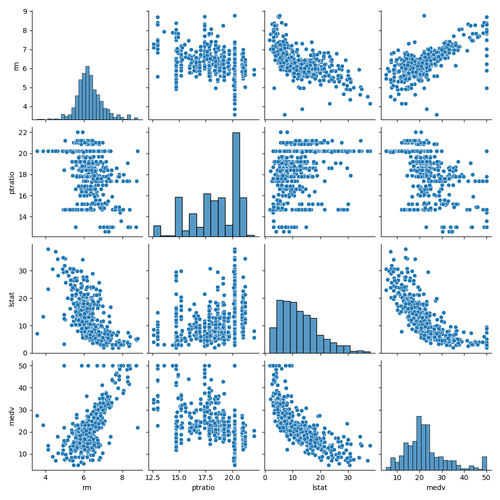
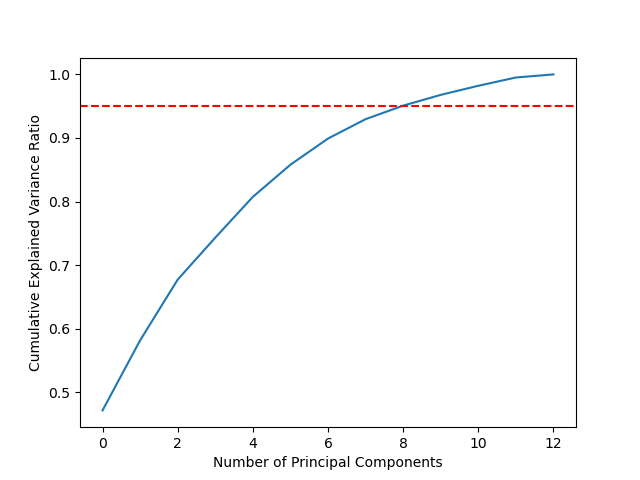
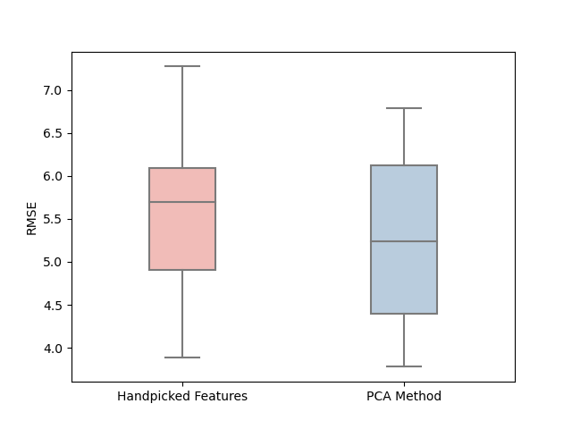
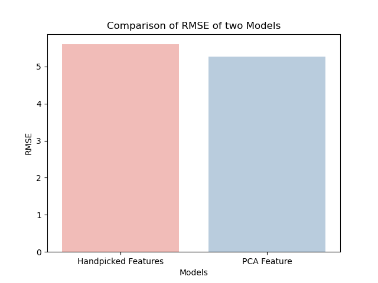

## Boston Housing Dataset Analysis

This repository contains the analysis and modeling of the Boston Housing dataset. The dataset provides information on various factors affecting housing prices in the Boston area. This file provides an overview of the analysis performed using both handpicked features and Principal Component Analysis (PCA).

### Prerequisites
Make sure you have the following modules installed:

- pandas
- numpy
- seaborn
- matplotlib
- scikit-learn
You can install these modules using pip:

```python
pip install pandas numpy seaborn matplotlib scikit-learn
```

### Handpicked Features

In the initial analysis, features were selected based on their correlation with the target variable (medv) and their correlation with each other. The following observations were made:


#### Correlation between Independent Variables:
- `dis` and `nox` have a strong negative correlation of -0.76.
- `dis` and `age` have a strong negative correlation of -0.74.
- `tax` and `rad` have a strong positive correlation of 0.91.

#### Correlation between Independent Variables and the Dependent Variable:
- `dis` has a positive correlation of 0.24 with `medv`.
- `nox` has a negative correlation of -0.42 with `medv`.
- `age` has a negative correlation of -0.37 with `medv`.
- `tax` has a negative correlation of -0.46 with `medv`.
- `rad` has a negative correlation of -0.38 with `medv`.

Based on these correlations, the following actions were taken:
- The `dis` and `rad` columns were dropped as they had strong correlations with other variables and the target variable.
- Additional features with a Pearson's correlation coefficient less than 0.5 with the target variable were also dropped.



Furthermore, after observing a weak relationship between `ptratio` and `medv` in the scatterplot, the `ptratio` column was dropped to further reduce the dimensionality of the dataset.

### Principal Component Analysis (PCA)

To explore dimensionality reduction and capture the most important information, PCA was applied to the Boston Housing dataset. The optimal number of principal components was determined using the following steps:

#### Determining the Optimal K Value:



1. The explained variance ratio of each principal component was calculated using the `explained_variance_ratio_` attribute.
2. The cumulative explained variance ratio was obtained by cumulatively summing the explained variance ratios.
3. A line plot of the cumulative explained variance ratio was generated to visualize the variance explained by each additional principal component.
4. The optimal number of components was identified based on a threshold of 95% variance.
5. The threshold was visualized in the plot using a red dashed line.
6. The optimal K value was determined as the number of principal components where the cumulative explained variance ratio crossed or exceeded the 95% threshold.
7. In this analysis, the optimal number of components based on 95% variance was found to be 9.

### Evaluation

The performance of both the linear regression model and the PCA-based model is evaluated using RMSE. The mean and standard deviation of RMSE values are calculated to assess the average performance and the consistency of the models. The results are visualized using box plots and bar plots to compare the RMSE values of the two models.





Please note that the code provided in the repository should be executed in a suitable programming environment to reproduce the analysis and obtain the results.

### Conclusion

This analysis provides two approaches for feature selection and dimensionality reduction in the Boston Housing dataset. The handpicked features were selected based on strong correlations between variables and the target variable, as well as correlations between independent variables. On the other hand, PCA was employed to reduce the dimensionality of the dataset while maintaining a significant portion of the explained variance.

The resulting feature subsets can be used for further modeling and analysis of the Boston Housing dataset. The handpicked features offer a human-interpretable approach, while the PCA-based approach provides a more automated and mathematical approach for dimensionality reduction. 